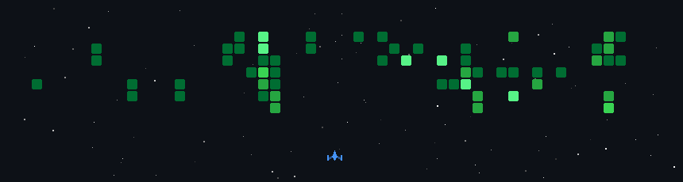

[](https://git.io/typing-svg)

<br>


<br>


<br><br>

<a href="https://sushantgajbhiye23.in">

</a>

<a href="https://www.linkedin.com/in/sushant-gajbhiye-2057213b0">

</a>

<a href="mailto:sushantgajbhiye99@gmail.com">

</a>

<a href="https://github.com/sushant23-git">

</a>

<br><br>


</div>

---

# About Me

Software Engineer and AI-focused developer pursuing a Bachelor of Engineering in Electronics & Telecommunication with strong expertise in full-stack product development, machine learning integration, computer vision systems, embedded technologies, and scalable software architecture.

My engineering approach combines product thinking, modern software development practices, and AI-driven innovation to build solutions that solve real-world problems while maintaining performance, scalability, and maintainability.

Currently focused on developing intelligent systems, enterprise web applications, computer vision solutions, embedded IoT products, and AI-powered user experiences.

### Open To

* Software Engineering Internships
* AI / Machine Learning Opportunities
* Full Stack Development Roles
* Open Source Collaborations
* Product Engineering Projects
* Research & Innovation Programs

> Based on experience, projects, certifications, and achievements from my professional profile.

---

# Tech Stack

### Languages

<p align="center">

</p>

### Frontend

<p align="center">

</p>

### Backend & Databases

<p align="center">

</p>

### Cloud, DevOps & Tooling

<p align="center">

</p>

---

# AI / ML Expertise

| Domain                 | Proficiency  | Details                                                     |
| ---------------------- | ------------ | ----------------------------------------------------------- |
| Generative AI          | Advanced     | Gemini API Integration, AI Applications, Prompt Engineering |
| Computer Vision        | Advanced     | OpenCV, Object Tracking, Motion Detection, Image Processing |
| AI Product Engineering | Advanced     | AI-Powered Web Applications & Intelligent Workflows         |
| Embedded AI            | Intermediate | AI Integration with IoT & Edge Devices                      |
| API Engineering        | Advanced     | REST APIs, AI Service Integration, Backend Connectivity     |

---

# Featured Projects

<details>
<summary><b>PlateSync — Enterprise ERP Management System</b></summary>

### Overview

Enterprise-grade ERP platform designed for canteen and plate management operations with inventory control, order lifecycle management, analytics, and role-based security architecture.

| Category    | Details                            |
| ----------- | ---------------------------------- |
| Stack       | JavaScript, HTML5, CSS3, REST APIs |
| Scale       | Multi-role ERP System              |
| Performance | Real-time Dashboard Updates        |
| Security    | Role-Based Access Control          |
| Impact      | Streamlined Operational Workflows  |
| Repository  | https://github.com/sushant23-git   |

### Engineering Highlights

* Designed scalable ERP architecture
* Implemented inventory tracking modules
* Developed responsive management dashboards
* Integrated backend communication using REST APIs
* Improved operational efficiency through automation

</details>

<details>
<summary><b>ESP8266 WiFi Robot Car with Radar Detection</b></summary>

### Overview

Embedded robotics platform integrating WiFi communication, radar visualization, obstacle detection, and mobile application control.

| Category    | Details                           |
| ----------- | --------------------------------- |
| Stack       | ESP8266, Arduino, Kotlin, HC-SR04 |
| Scale       | IoT Robotics Platform             |
| Performance | Real-Time Detection               |
| Security    | Local Network Communication       |
| Impact      | Intelligent Autonomous Navigation |
| Repository  | https://github.com/sushant23-git  |

### Engineering Highlights

* Developed radar scanning system
* Built Android-based controller
* Implemented wireless communication layer
* Integrated motor control and sensor fusion
* Optimized obstacle detection accuracy

</details>

<details>
<summary><b>Technotsav-ETC 2K26 Event Management Platform</b></summary>

### Overview

Modern event management ecosystem developed for a technical festival, featuring registrations, event listings, scheduling workflows, and responsive experiences.

| Category    | Details                          |
| ----------- | -------------------------------- |
| Stack       | HTML5, CSS3, JavaScript          |
| Scale       | 500+ Potential Participants      |
| Performance | Optimized Frontend Delivery      |
| Security    | Form Validation & Sanitization   |
| Impact      | Improved Event Operations        |
| Repository  | https://github.com/sushant23-git |

### Engineering Highlights

* Mobile-first architecture
* Registration workflow automation
* Dynamic event presentation system
* Responsive user experience
* Cross-device optimization

</details>

<details>
<summary><b>Interactive Ball Game — Computer Vision Controller</b></summary>

### Overview

Computer vision powered gaming system enabling real-time interaction using webcam-based motion tracking and object detection algorithms.

| Category    | Details                          |
| ----------- | -------------------------------- |
| Stack       | Python, OpenCV                   |
| Scale       | Real-Time Interactive System     |
| Performance | 30+ FPS Processing               |
| Security    | Local Processing                 |
| Impact      | Gesture-Based Interaction        |
| Repository  | https://github.com/sushant23-git |

### Engineering Highlights

* Color-based object tracking
* Contour detection algorithms
* Real-time computer vision pipeline
* Interactive gaming integration
* Performance optimization for smooth gameplay

</details>

---

## Certifications


---

# Coding Profiles

<div align="center">

<a href="https://www.hackerrank.com">

</a>

</div>

---

# GitHub Analytics

<div align="center">


</div>

---

# GitHub Trophies

<div align="center">


</div>

---

# Contribution Activity

<div align="center">


</div>

---

# Activity Shooter

<p align="center">
  
</p>
# <div align="center">

---

# Current Focus

```yaml
Learning:
  - Advanced Data Structures & Algorithms
  - Machine Learning Engineering
  - Cloud Architecture
  - Distributed Systems

Building:
  - AI-Powered Applications
  - Full Stack SaaS Products
  - Open Source Solutions
  - Enterprise Web Platforms

Exploring:
  - LLM Applications
  - Agentic AI Systems
  - Computer Vision
  - Embedded Intelligence

Open_To:
  - Internships
  - Software Engineering Roles
  - AI/ML Opportunities
  - Open Source Collaboration
```

---

# Connect

<div align="center">

<a href="mailto:sushantgajbhiye99@gmail.com">

</a>

<a href="https://www.linkedin.com/in/sushant-gajbhiye-2057213b0">

</a>

<a href="https://github.com/sushant23-git">

</a>

<a href="https://sushantgajbhiye23.in">

</a>

</div>

---

<div align="center">

*"Engineering intelligent systems that transform ideas into scalable products."*

</div>


